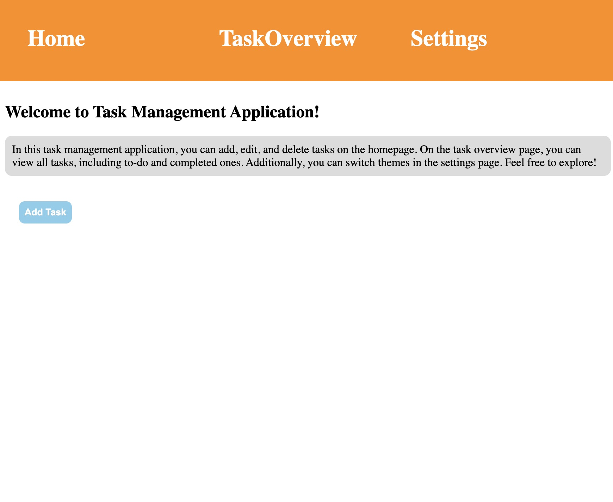
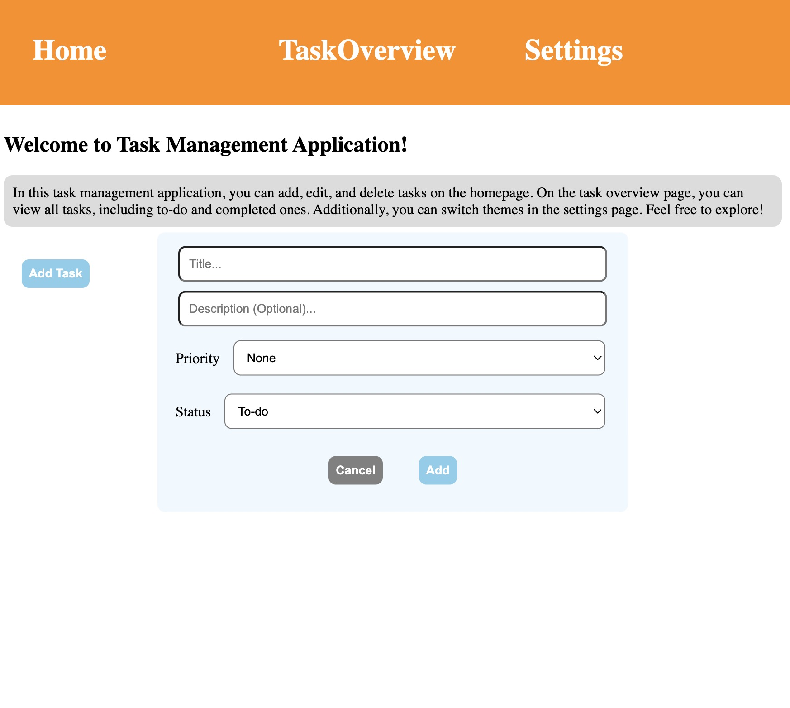
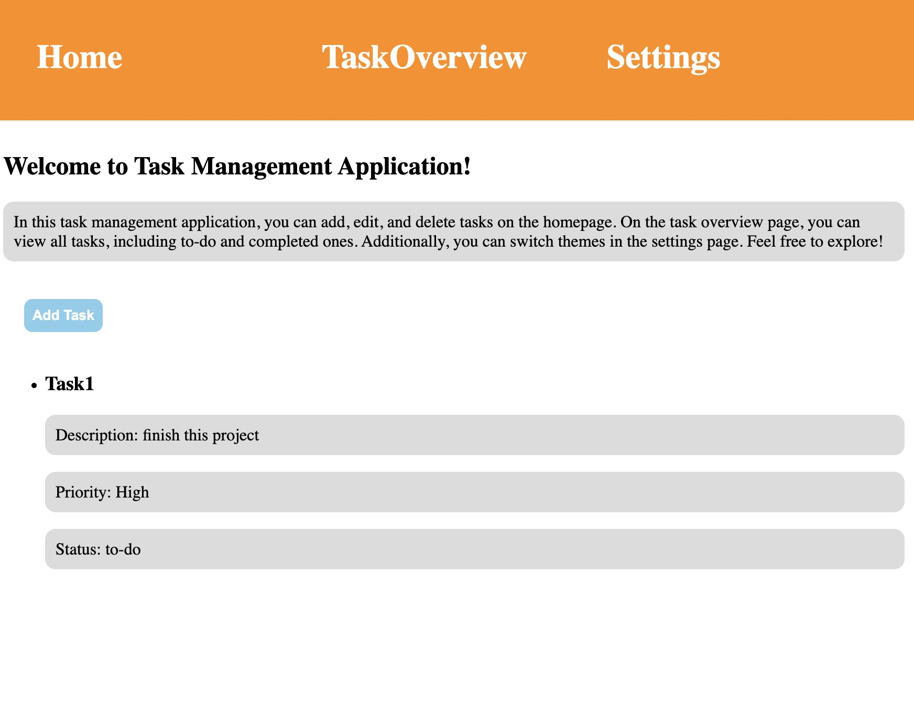
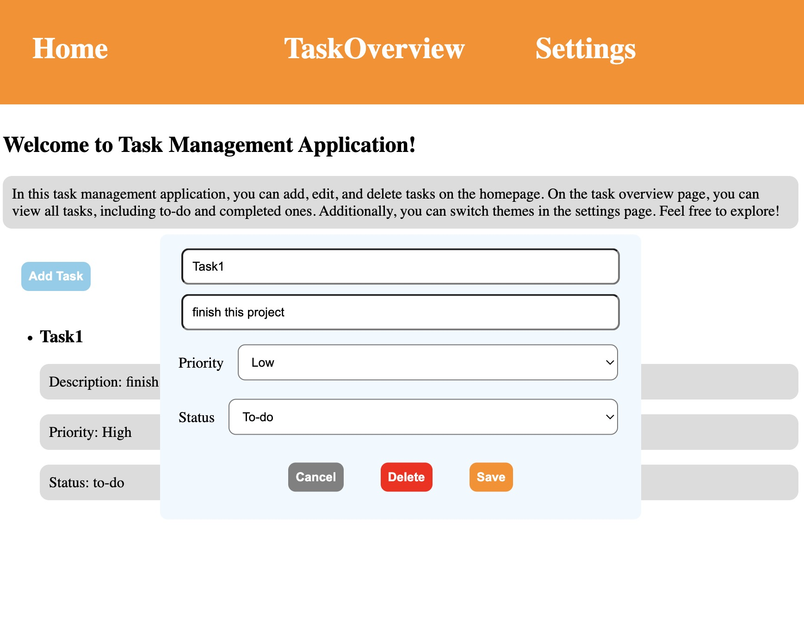
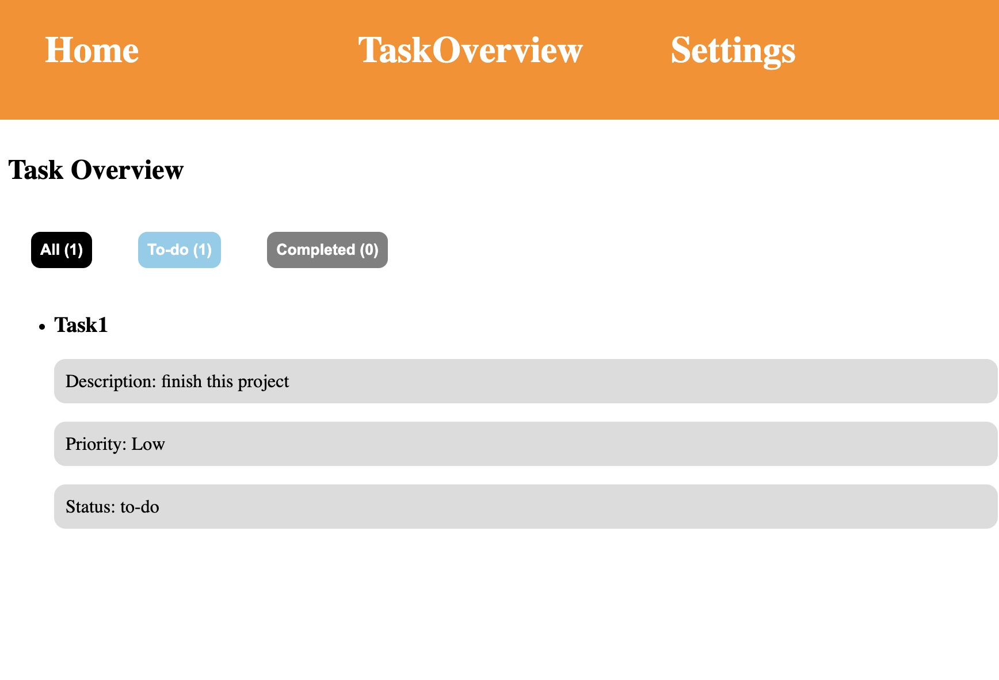
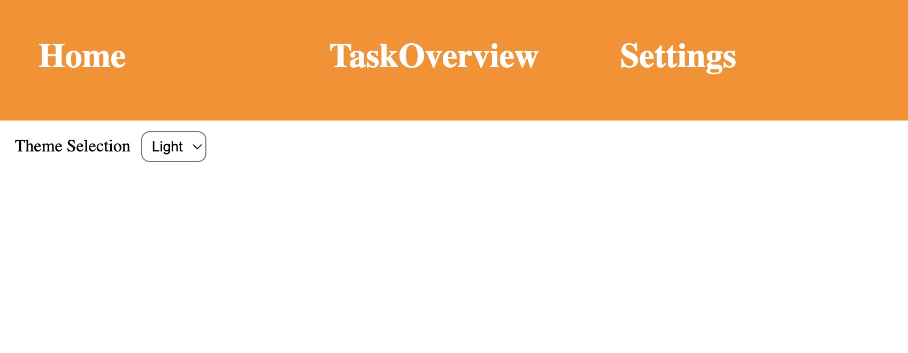

# Task Management Application

## Introduction

This application functions similarly to a typical Reminders app, allowing users to manage their tasks effectively. In the `Home` page, it provides functionalities for adding, deleting, and modifying tasks, including attributes like title, description, priority, and status. Users can also view the number of tasks per status through the `Task Overview` page and switch themes in the `Settings` page.

## Features

- **Home**: Users can add tasks in the home page with details such as title, description, priority, and status. When the added task is clicked, users can modify this task.
   

  

  

  

- **Task Overview**: View a summary of tasks categorized by their status to keep track of your work.
 

- **Theme Switching**: Attempt to switch themes via the settings menu (Note: this feature is currently non-functional and is included for future updates).
 

## Installation

To set up the project on your local machine:

1. Clone the repository to your local machine.
2. Navigate to the project directory.
3. Run the following commands to install dependencies and start the development server:

```bash
npm install
npm run dev
